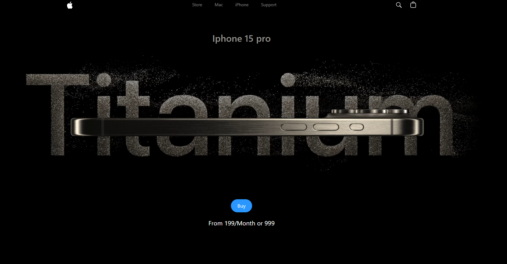

# Apple Clone Web App

<!-- Add Badges here -->




Welcome to the **Apple Clone Web App**! This project is a stunning, high-performance replica of the Apple website, focusing on interactive 3D elements, smooth scroll animations, and premium web design aesthetics.

**[🚀 View Live Demo](https://iphone-landing-page-clone.netlify.app/)** <!-- Make sure to replace this link when you deploy -->

## 🌟 Overview

I built this project to challenge myself with complex front-end animations and 3D rendering in the browser. It perfectly mimics the premium, cinematic feel of Apple's product pages. 

## 📸 Screenshots & Previews

<!-- Add your actual screenshots or GIFs here -->
*Include a GIF demonstrating the 3D scroll animations here to immediately grab attention.*

| Hero Section | 3D Model Interaction |
| :---: | :---: |
|  |  |

## 🚀 Key Features

- **Interactive 3D Models**: Explore the device from every angle with interactive 3D models built using Three.js and React Three Fiber.
- **Cinematic Animations**: Smooth, high-performance scroll and entrance animations powered by GSAP.
- **Video Carousel**: A custom video carousel highlighting key features smoothly.
- **Premium Design**: Pixel-perfect implementation of Apple's sleek dark mode design using Tailwind CSS.
- **Performance Optimized**: Built with Vite and React for lightning-fast loading and rendering.

## 🧠 What I Learned

Building this project taught me several valuable skills:
- **3D Optimization**: Managing geometries, materials, and lighting in `react-three-fiber` while maintaining 60fps performance on the web.
- **Complex Timelines**: Orchestrating scroll-triggered animations using `GSAP ScrollTrigger` so elements sync perfectly with the user's scroll position.
- **Component Architecture**: Breaking down complex UI sections into reusable, maintainable React components.

## 🛠️ Tech Stack

- **Framework**: [React 18](https://react.dev/) + [Vite](https://vitejs.dev/)
- **Styling**: [Tailwind CSS](https://tailwindcss.com/)
- **3D Rendering**: [Three.js](https://threejs.org/), [@react-three/fiber](https://docs.pmnd.rs/react-three-fiber/getting-started/introduction), [@react-three/drei](https://github.com/pmndrs/drei)
- **Animations**: [GSAP](https://gsap.com/)
- **Error Tracking**: [Sentry](https://sentry.io/)

## 📂 Getting Started

### Prerequisites

Make sure you have Node.js installed on your machine.

### Installation

1. Clone the repository:
   ```bash
   git clone https://github.com/AsadBulediReal/apple-clone-app.git
   ```
2. Navigate to the project directory:
   ```bash
   cd apple-clone-app
   ```
3. Install the dependencies:
   ```bash
   npm install
   ```

### Running Locally

```bash
npm run dev
```
The app will be available at `http://localhost:5173`.

## 📬 Contact

Created by **[Asad Jamil Buledi](https://github.com/AsadBulediReal)** - feel free to reach out!
- LinkedIn: [Asad Jamil Buledi](https://linkedin.com/in/asad-jamil-buledi-7b1154245)
- GitHub: [AsadBulediReal](https://github.com/AsadBulediReal)
- Email: [bulediasadjamil@gmail.com](mailto:bulediasadjamil@gmail.com)

---
*This project is for educational purposes and is not affiliated with Apple Inc.*
